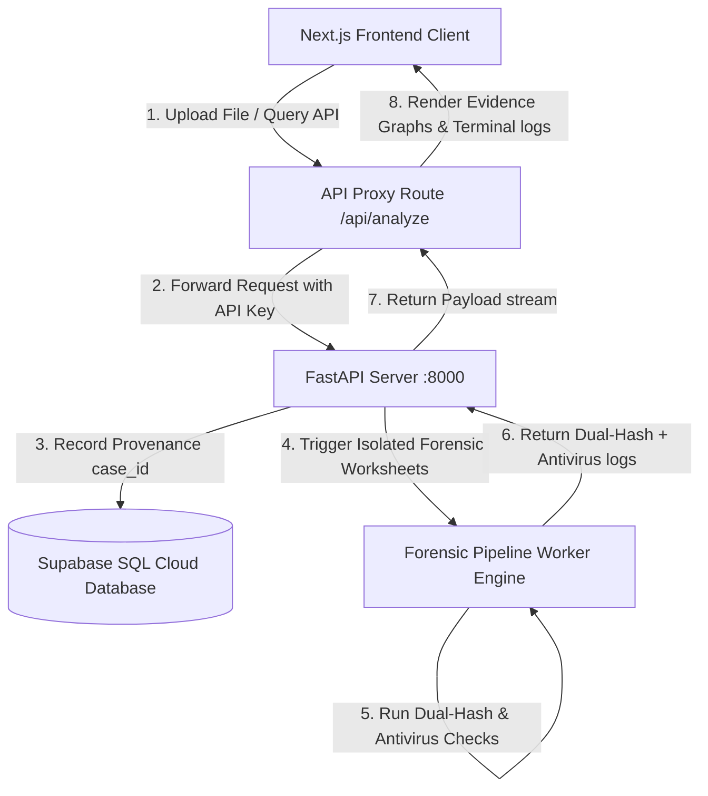
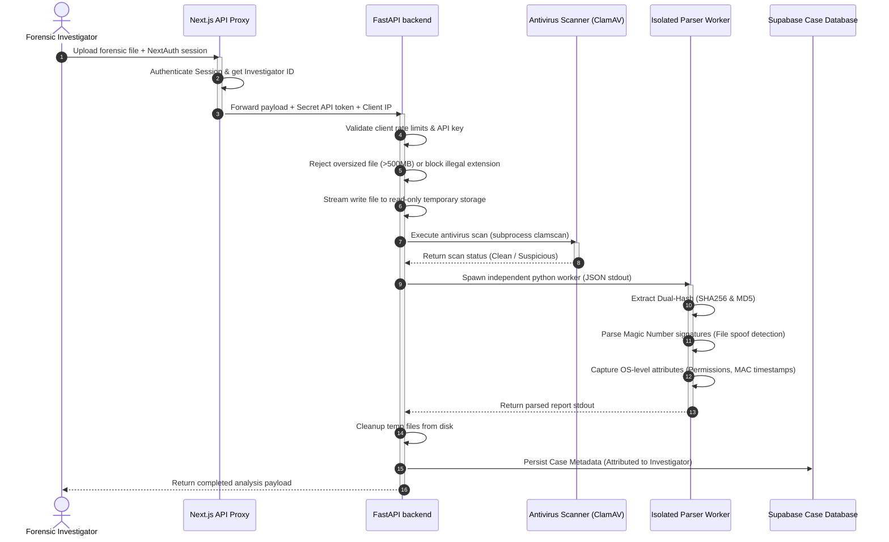

# Forensic Pro Suite - Architectural Blueprint & Design Document

This document provides a comprehensive technical overview of the **Forensic Pro Suite** architecture. It details the interaction boundaries between the Next.js frontend workstation, the FastAPI analysis engine backend, the Supabase storage and analytics tiers, and downstream background processors.

---

## System Context Model



---

## Architectural Components

### 1. Frontend Workstation (client)
* **Technology Stack**: Next.js 16 (App Router), React 19, Tailwind CSS v4, TypeScript v5, Framer Motion (micro-animations), Recharts (graph logs), `@xyflow/react` (interactive Evidence Nodes).
* **Role**: Provides the investigator's security workstation dashboard. It handles pre-flight client-side constraints (validation of allowed file types and limits) and renders the provenance chain-of-custody charts.
* **Security Layer**: Leverages `next-auth` integration (JWT sessions with role-based attributes) to guard all pages and outgoing proxy lanes.

### 2. Backend Analysis Engine (Server)
* **Technology Stack**: FastAPI (Python 3.11), Supabase Python client, PyTest (unit validation).
* **Role**: Handles direct binary processing operations. It processes file uploads, inspects folder archives, runs dual-hash integrity verifications (matching SHA-256 and MD5 side-by-side), and coordinates antivirus sweeps.
* **Diagnostics Bootstrap**: Automatically validates system environment configurations (`SUPABASE_URL`, token access lanes) upon initialization, preventing runtime boot errors and ensuring rapid developer setups.

### 3. Database & Storage Tier (Supabase)
* **Role**: Acts as the centralized registry for case files, metadata audit logs, and evidence graph nodes.
* **Relational Schema**: Manages the `cases` table to preserve immutable digital fingerprints (such as SHA-256 hashes, file sizes, creation timestamps, and designated investigator claims).

---

## Lifecycle of a Forensic Case

1. **Ingest & Validation**: The investigator selects an evidence file (.pcap, .dd, etc.). The Next.js client confirms it is under the 500 MB limit and dispatches it.
2. **Analysis Pipeline**: The FastAPI server streams the file to a secure, isolated temp workspace, calculates dual hashes simultaneously, runs standard file signature scans, and flags malicious components.
3. **Immutability Logging**: Once calculations complete, case characteristics (SHA-256, filesizes, user claims) are instantly inserted into the database to enforce the chain of custody.
4. **Interactive Mapping**: The Next.js frontend updates its live Recharts timelines and interactive React Flow charts to render the new file node inside the global case grid.
# 🛡️ Forensic Pro Workstation: Technical Architecture & System Design

This document details the software architecture, ingestion pipelines, security boundaries, and data models of the **Forensic Pro Suite**.

---

## 🗺️ 1. System Overview & Architecture

The Forensic Pro Workstation is designed as a hybrid Next.js + FastAPI solution following defense-in-depth principles for digital forensics (NIST SP 800-86). The workstation consists of two core components:
1. **Frontend CLI Workstation (`client`)**: A modern Next.js single-page application integrating React Flow for evidence relationships, Xterm.js for simulated investigator operations, and jsPDF for chain-of-custody reporting.
2. **Analysis Backend (`Server`)**: A FastAPI microservice executing file integrity parsing, antivirus scanning, static heuristics, and isolated subprocess forensic calculations.

---

## 📡 2. Data Ingestion Pipeline (Data Flow)

The diagram below illustrates the path of a forensic artifact from investigator upload to database persistence and geospatial rendering.



---

## 🔑 3. Dual-Hash Integrity Pipeline

Forensic integrity relies on the immutability of evidence. The `ForensicEngine` processes uploads using a **Dual-Hash Integrity Pipeline** (SHA-256 + MD5):
* **SHA-256**: Generates a collision-resistant unique fingerprint (`256-bit`) used for primary hash verification against global threat intelligence lookup tables.
* **MD5**: Provides backward compatibility with traditional database engines and verifies legacy chain-of-custody ledgers.

Both hashes are computed in a single stream block to avoid redundant file I/O operations:
```python
# Engine implementation logic
sha256 = hashlib.sha256()
md5 = hashlib.md5()
with open(file_path, "rb") as f:
    while chunk := f.read(64 * 1024):
        sha256.update(chunk)
        md5.update(chunk)
```

---

## 🛡️ 4. Security Boundaries & Threat Heuristics

To protect the investigator's workstation from hostile payloads (e.g. decompression bombs, obfuscated malware, API abuse), the system implements four layers of protection:

### 1. Magic File Signatures (Spoof Detection)
Attackers frequently disguise dangerous executables by changing their file extension (e.g., `payload.exe` renamed to `logs.txt`). The `ForensicEngine` performs **Magic Number Validation** by reading the initial file headers and matching them against signatures (e.g. `0x89 0x50 0x4E 0x47` for PNG, `%PDF` for PDF). If the signature does not match the extension, it alerts the investigator of extension spoofing.

### 2. Decompression Limits (Anti-Zip Bomb)
Compressed archives are analyzed before decompression using safety thresholds:
* **Max Decompressed Bytes**: `2 GB`
* **Max Entries**: `10,000` files
* **Max Decompression Ratio**: `100.0` (Rejects high ratio compression patterns typical of Zip Bombs).

### 3. Local Antivirus Scanning
All incoming artifacts are processed via an active local antivirus engine (`clamscan` / `clamdscan`). Malicious artifacts trigger immediate isolation and return a `400 Bad Request` safety block.

### 4. Sliding-Window Rate Limiting
To prevent denial-of-service (DDoS) and automated script scraping, a sliding-window token-bucket rate limiter protects the API endpoints:
* Configured by default to `30 requests per minute` per client IP.
* Returns `429 Too Many Requests` with a calculated `Retry-After` header.

---

## 🗄️ 5. Database Schema (Supabase Case Store)

Cases are stored within a PostgreSQL database managed by Supabase, structured as follows:

| Column Name | Type | Description |
|---|---|---|
| `id` | `uuid` | Primary Key, auto-generated |
| `case_id` | `text` | Unique human-readable case identifier (`CASE-TIMESTAMP`) |
| `filename` | `text` | Uploaded evidence file name |
| `hash_value` | `text` | SHA-256 integrity hash prefix |
| `investigator`| `text` | Authed Investigator username/role |
| `status` | `text` | Current verification status (`Pending Review`, `Completed`) |
| `created_at` | `timestamp` | Time of ingestion |

---

## 🎨 6. Responsive UI Design System

* **next-themes**: Coordinates client-side theme variables.
* **tailwind-v4**: Tailored HSL colors allow high contrast and deep spacing grids to shift dynamically between light/dark environments.
* **React Flow Canvas**: Dynamic background rendering, minimaps, and SVG control styling dynamically adapt to light vs. dark mode interfaces.
