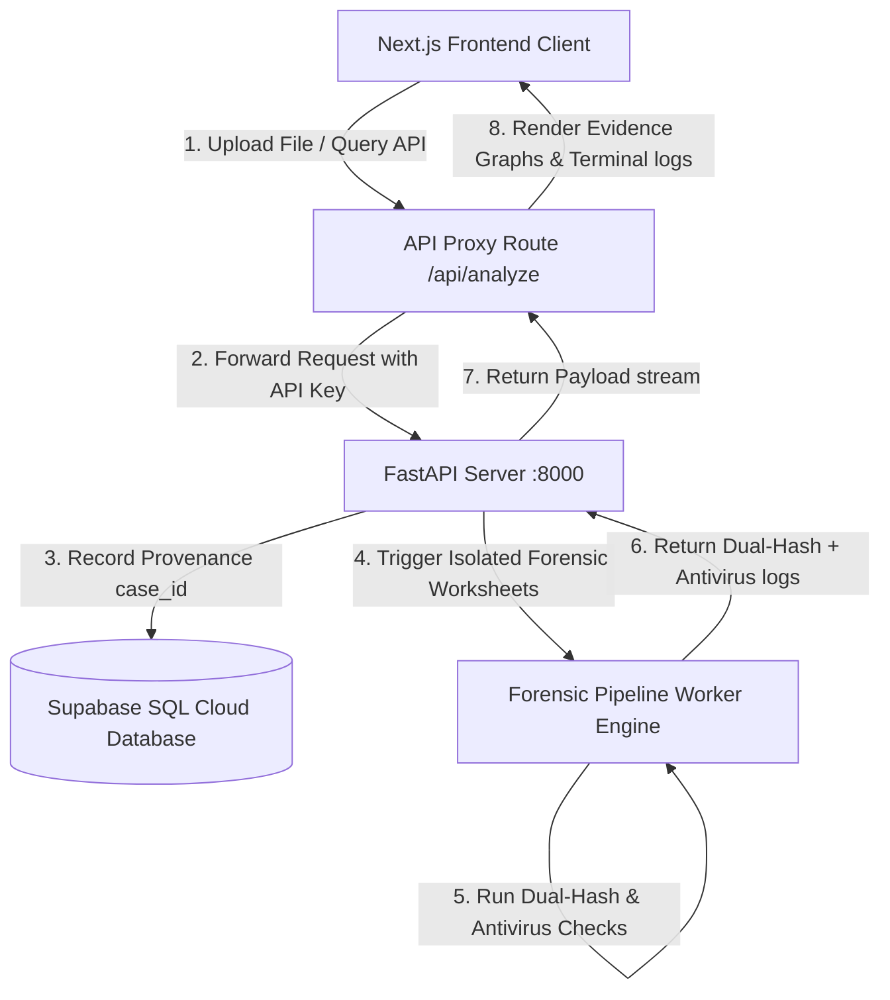

# Forensic Pro Suite - Architectural Blueprint & Design Document

This document provides a comprehensive technical overview of the **Forensic Pro Suite** architecture. It details the interaction boundaries between the Next.js frontend workstation, the FastAPI analysis engine backend, the Supabase storage and analytics tiers, and downstream background processors.

---

## System Context Model

---

## Architectural Components

### 1. Frontend Workstation (client)
* **Technology Stack**: Next.js 16 (App Router), React 19, Tailwind CSS v4, TypeScript v5, Framer Motion (micro-animations), Recharts (graph logs), `@xyflow/react` (interactive Evidence Nodes).
* **Role**: Provides the investigator's security workstation dashboard. It handles pre-flight client-side constraints (validation of allowed file types and limits) and renders the provenance chain-of-custody charts.
* **Security Layer**: Leverages `next-auth` integration (JWT sessions with role-based attributes) to guard all pages and outgoing proxy lanes.

### 2. Backend Analysis Engine (Server)
* **Technology Stack**: FastAPI (Python 3.11), Supabase Python client, PyTest (unit validation).
* **Role**: Handles direct binary processing operations. It processes file uploads, inspects folder archives, runs dual-hash integrity verifications (matching SHA-256 and MD5 side-by-side), and coordinates antivirus sweeps.
* **Diagnostics Bootstrap**: Automatically validates system environment configurations (`SUPABASE_URL`, token access lanes) upon initialization, preventing runtime boot errors and ensuring rapid developer setups.

### 3. Database & Storage Tier (Supabase)
* **Role**: Acts as the centralized registry for case files, metadata audit logs, and evidence graph nodes.
* **Relational Schema**: Manages the `cases` table to preserve immutable digital fingerprints (such as SHA-256 hashes, file sizes, creation timestamps, and designated investigator claims).

---

## Lifecycle of a Forensic Case

1. **Ingest & Validation**: The investigator selects an evidence file (.pcap, .dd, etc.). The Next.js client confirms it is under the 500 MB limit and dispatches it.
2. **Analysis Pipeline**: The FastAPI server streams the file to a secure, isolated temp workspace, calculates dual hashes simultaneously, runs standard file signature scans, and flags malicious components.
3. **Immutability Logging**: Once calculations complete, case characteristics (SHA-256, filesizes, user claims) are instantly inserted into the database to enforce the chain of custody.
4. **Interactive Mapping**: The Next.js frontend updates its live Recharts timelines and interactive React Flow charts to render the new file node inside the global case grid.
